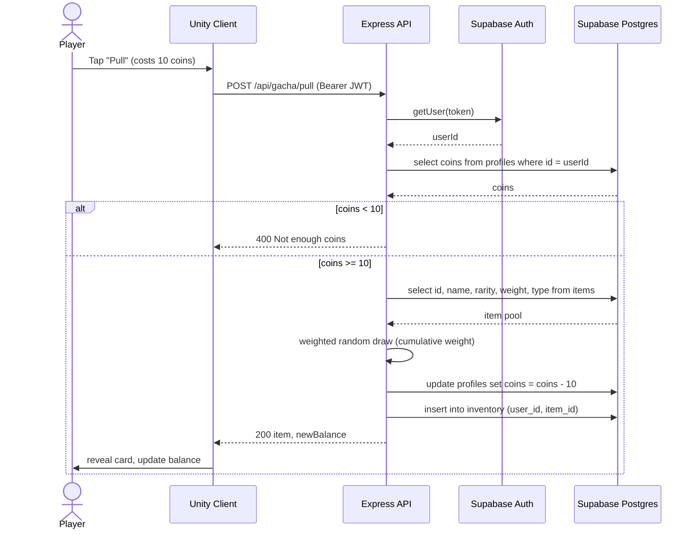
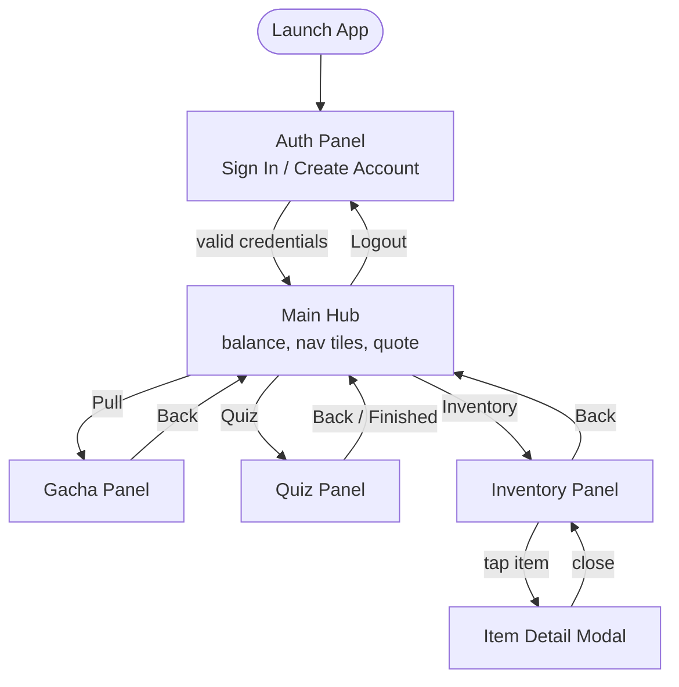
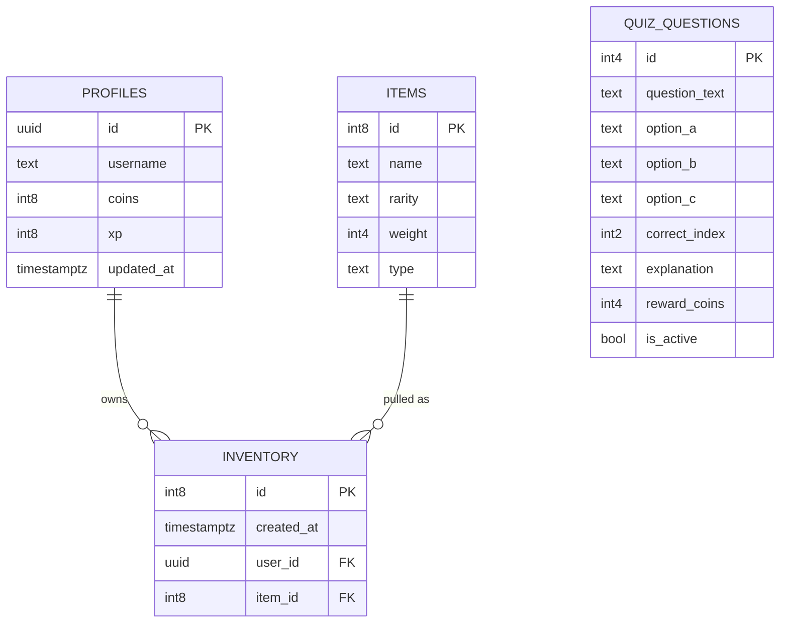

# Milestone II Submission

## Team Name
Prata&Bao

## Proposed Level of Achievement
Apollo 11

## Motivation

Gacha games are enormously popular, yet most players engage with them without understanding the mechanics underneath: the weighted randomness, the secure coin economy, the real-time sync between client and server. As fans of these games ourselves, we wanted to build one from the ground up to understand exactly how they work.

At the same time, most gacha games offer no real-world value beyond entertainment. We believe that **learning and fun are not mutually exclusive**, and that the engagement loop of a gacha game is a powerful vehicle for education. Every item a player pulls and every quiz question they answer is an opportunity to discover something real about the natural world. Our goal is for players to walk away knowing what a mangrove is, why coral reefs matter, or why sea turtles are endangered, not because they studied, but because they were playing.

The technical challenge is also compelling. Building a gacha game requires solving a full-stack problem: a Unity game client, a secure Node.js backend that protects sensitive operations like coin deduction, and a live Supabase database, all working together in real time.

## Vision

Gaia Gacha is a PC and mobile-ready ecology-themed gacha game built in Unity, backed by a Node.js REST API and Supabase.

Players register an account, log in, and spend **Eco-Coins** on gacha pulls to discover ecology specimens of varying rarity. The rarity system mirrors real-world conservation scarcity: common species appear frequently, while endangered or rare specimens are harder to find. A quiz system lets players earn Eco-Coins by correctly answering ecology questions, creating a loop where **learning is directly rewarded**.

Ultimately, we envision Gaia Gacha as a game that proves learning can be genuinely fun, where players build their ecology knowledge naturally through play, without it ever feeling like studying.

## User Profiling

Our primary target audience is **casual gamers aged 15 to 30** who enjoy collection and gacha games (e.g. Genshin Impact, Pokemon GO). They are motivated by:

1. **The thrill of randomised discovery**: the anticipation of a pull and the satisfaction of getting a rare item.
2. **Collection completion**: the drive to fill out an inventory and see progress towards a full set.

Our secondary audience is **students and young adults with a curiosity about nature and conservation**, who find traditional learning dry but respond well to game-based experiences. For this audience, Gaia Gacha offers a way to engage with ecology topics such as species, ecosystems, and conservation status, in a format that feels rewarding rather than academic.

The core insight behind the project is that these two audiences overlap more than they might seem. Players motivated by collection are receptive to learning when it is wrapped in a satisfying game loop. The quiz system and ecology-themed items are designed specifically to reach this overlap, making learning feel like a natural part of playing rather than a detour from it.

## User Stories

1. As a player, I want to create an account and log in securely so that my collection is tied to my identity.
2. As a player, I want to spend Eco-Coins on gacha pulls so that I can discover new ecology items.
3. As a player, I want to see the item I receive with clear visual feedback (its name, rarity, and tier) so that each pull feels rewarding.
4. As a player, I want my coin balance to update immediately after each pull so that I always know how many pulls I have left.
5. As a player, I want a home base screen after logging in so that I can navigate to different parts of the game easily.
6. As a player, I want to browse my inventory so that I can track my collection and see what I am still missing.
7. As a player, I want to filter and sort my inventory by type and rarity so that I can find specific items quickly as my collection grows.
8. As a player, I want to tap an item in my inventory to see its scientific name and a short fact about it so that I learn something concrete every time I check my collection.
9. As a player, I want to answer ecology quizzes so that I can earn Eco-Coins while learning about the natural world.
10. As a player, I want immediate feedback on whether my quiz answer was correct, along with an explanation, so that I learn from both right and wrong answers.
11. As a player, I want a game with a polished, ecology-themed UI so that the experience feels cohesive and immersive.
12. As a player, I want to be able to earn more Eco-Coins through gameplay so that there is a reason to keep returning.

## Scope of Project

Gaia Gacha is a full-stack gacha game featuring a **Unity 6** frontend and a **Node.js/Express** backend, connected to a **Supabase** database. Players interact entirely through the Unity client, which communicates with the backend over HTTPS to authenticate users, process gacha pulls, manage inventory, and run quizzes.

The project is split into two components:

- **`gaia-gacha-frontend`**: the Unity game, containing the Auth screen, Main Hub, Gacha screen, Inventory screen, and Quiz screen.
- **`gaia-gacha-backend`**: the Express REST API, handling authentication, gacha pull logic, inventory queries, and quiz grading. Deployed to Fly.io.

---

## System Architecture

The fullstack pipeline itself was a deliberate focus of this milestone: every layer, from the Unity client through the Express API to Supabase, was hardened and deployed to a live server, so the core gameplay loop built on top of it (earning, spending, collecting, navigating) rests on a secure and extendable foundation rather than a development-only setup.

The Unity client never touches the database directly. All sensitive operations (coin deduction, inventory writes, authentication) are handled exclusively on the Express server.

The backend uses **two separate Supabase clients** rather than one:

- A client built with the **service role key**, used for every admin-level database read and write (coins, items, inventory, quiz questions).
- A client built with the **anon key**, used only to verify login credentials and issued JWTs.

This split exists because calling Supabase's `signInWithPassword()` attaches that session to whichever client invoked it. Reusing the service-role client for login would risk an elevated, admin-scoped client leaking into a request that should only ever see one player's session. Keeping the anon-key client isolated to authentication closes that risk off entirely.

Every protected route (`/api/gacha/pull`, `/api/inventory`, `/api/quiz/answer`) is gated by a single `requireAuth` middleware that verifies the bearer JWT against Supabase Auth and attaches the resolved user id to the request. The backend is containerised with Docker (`node:22-alpine`) and deployed to Fly.io in the Singapore region.

```mermaid
flowchart LR
    subgraph Client["Unity 6 Client"]
        Auth["AuthManager"]
        Hub["MainHubUIManager"]
        Gacha["GachaManager"]
        Inv["InventoryManager"]
        Quiz["QuizManager"]
    end

    Client -->|"HTTPS / JSON via UnityWebRequest"| API

    subgraph API["Express API - Fly.io, Node 22, Docker"]
        MW{{"requireAuth (JWT middleware)"}}
        AuthRoute["POST /api/auth/register, /api/auth/login"]
        GachaRoute["POST /api/gacha/pull"]
        InvRoute["GET /api/inventory"]
        QuizRoute["GET /api/quiz/questions, POST /api/quiz/answer"]
        MW --> GachaRoute
        MW --> InvRoute
        MW --> QuizRoute
    end

    API -->|"service role key (admin queries)"| DB
    API -->|"anon key (login verification only)"| SupaAuth[("Supabase Auth")]

    subgraph DB["Supabase Postgres"]
        Profiles[("profiles")]
        Items[("items")]
        Inventory[("inventory")]
        QuizQ[("quiz_questions")]
    end
```

### Request flow: a gacha pull

The diagram below traces the most security-sensitive flow in the app, since it touches authentication, currency, and a database write in one request.

---

## User Flow

All five panels (Auth, Hub, Gacha, Inventory, Quiz) live inside a single Unity scene and are shown or hidden as the player navigates, rather than loading separate scenes. This keeps the `AuthManager` session (the in-memory JWT and user id) alive across the whole session without needing to persist it across scene loads.

---

## Database Schema

The schema lives in Supabase Postgres. `profiles.id` is a foreign key into Supabase's own `auth.users` table, which Supabase manages outside this schema; a profile row (with a starting Eco-Coins balance) is provisioned automatically when an account is created, since the register endpoint itself only creates the `auth.users` row and never inserts into `profiles` directly.

A few deliberate design choices:

- **`items` is a table, not a hardcoded list.** Drop weights and the item pool can be rebalanced or expanded directly in Supabase, without a redeploy of either the backend or the Unity client.
- **`inventory` has no quantity column.** Every pull inserts a new row, so duplicate pulls of the same item are just additional rows. The `/api/inventory` endpoint groups these by `item_id` and returns a count plus the earliest `created_at` per item, rather than maintaining a running total in the database itself.
- **`quiz_questions` uses a soft-delete flag (`is_active`)** instead of deleting rows outright, so retired questions stay in the table for record-keeping while no longer being served.
- **Items are referenced by a stable integer id everywhere** (database, API responses, and the Unity `ItemRegistry`), after an earlier refactor replaced name-based lookups. This avoids subtle bugs where renaming a display text would silently break a lookup.
- **`profiles` also carries `username` and `xp` columns** that no current route reads or writes. These are schema groundwork for a profile/leveling feature that has not been built yet.

---

## Features

The features completed this milestone form one coherent loop: Quiz lets players earn Eco-Coins, Gacha lets them spend them, Inventory shows the tangible reward of that spending, and the Main Hub ties all of it together as a single place to navigate from. Together they make the core game loop playable end to end, on top of the hardened, deployed backend described above.

Features are tagged as follows:

**[Proposed]**: planned for the Minimum Viable Product (MVP) by Splashdown.

**[Current Progress]**: what has been implemented as of Milestone 2.

**[Additional Features]**: add-ons to improve the product after the MVP is complete.

---

### AUTHENTICATION SYSTEM

**[Proposed]**

Players register a new account with an email and password, and log in to access the rest of the game. Sessions are secured using JWTs issued by Supabase. The Unity client holds the token in memory for the duration of the session.

**[Current Progress]**

Registration and login are fully implemented. The Unity `AuthManager` sends POST requests to `/api/auth/register` and `/api/auth/login`. On successful login, the backend returns a JWT, a user id, and the player's current Eco-Coins balance in a single response, which `AuthManager` stores for use by every other manager.

Since Milestone 1, every protected route has been brought under a single `requireAuth` middleware that verifies the JWT against Supabase Auth before the request reaches any route handler. The backend has also been hardened to stop returning raw database error messages to the client, and the Unity client no longer logs the full auth response body or the session token, so secrets and internal error detail stay out of logs.

**[Additional Features]**

- Forgot-password / reset flow.
- Optional social login (Google) for faster onboarding.

---

### GACHA PULL SYSTEM

**[Proposed]**

Players spend **10 Eco-Coins** per pull. Each pull draws one item from a weighted pool of ecology-themed specimens, seeded initially as:

| Item | Rarity | Drop Rate |
|------|--------|-----------|
| Mangrove Seed | Common | 70% |
| Coral Fragment | Rare | 25% |
| Giant Sea Turtle Shell | Legendary | 5% |

The pull result is displayed on an **item card** with the item's name, a colour-coded rarity badge, and diamond indicators showing tier.

**[Current Progress]**

The gacha system is fully implemented and JWT-protected. On `POST /api/gacha/pull`, the backend fetches the player's coin balance, rejects the pull if it is below 10, fetches the full `items` table, performs a weighted random draw using cumulative weights, deducts the coins, inserts the result into `inventory`, and returns the item plus the new balance in one response.

On the client, item rendering was refactored into a two-layer architecture that separates item data (`ItemDefinition`, `ItemRegistry`) from rendering (`CardDisplay`, the `ItemCard` prefab), and items are now looked up by a stable integer id rather than by name. The pull card itself received a stamp-style visual treatment. The pull button is locked during an in-flight request to prevent duplicate submissions.

**[Additional Features]**

- Expand the item pool with more ecology specimens across additional biomes (rainforest, ocean, wetlands, arctic).
- Animated pull reveal (card flip, particle effects) to heighten the moment of anticipation.
- Pity system: guaranteed Rare after 10 pulls without one, guaranteed Legendary after 50.
- Multi-pull: spend 90 Eco-Coins for 10 pulls at once.

---

### INVENTORY SYSTEM

**[Proposed]**

Players view all items they have collected in a scrollable panel, filtered by rarity, with each entry showing the item name, rarity badge, and date obtained.

**[Current Progress]**

The Inventory screen is fully implemented. `GET /api/inventory` returns the player's collection grouped by item, with a count of copies owned and the date the item was first obtained. The Unity `InventoryManager` renders this as a grid, supports filtering by type (Flora / Fauna) and sorting by rarity, name, or date, and shows a running collected count. Tapping an item opens a detail modal showing its scientific name and a short descriptive fact, giving the collection loop its first real piece of educational payoff beyond the pull itself.

**[Additional Features]**

- Collection progress tracker: extend the existing collected count into a full "X of Y collected" indicator per biome, once the item pool is expanded.

---

### ECO-COINS EARNING LOOP

**[Proposed]**

Players earn Eco-Coins through daily login bonuses and in-game activities, giving them a reason to return regularly.

**[Current Progress]**

The quiz screen now gives players their first active earning loop: a correct answer awards the `reward_coins` value configured on that question, and the new balance is returned immediately to the client. Coin balances for new accounts are still provisioned with a default starting balance rather than a deliberate onboarding grant. The daily login bonus itself has not yet been implemented and is carried forward to Milestone 3.

---

### MAIN HUB

**[Proposed]**

After logging in, players land on a **Main Hub** screen that serves as the central navigation point for the game, showing their Eco-Coins balance and links to the Gacha, Quiz, and Inventory screens.

**[Current Progress]**

The Main Hub is fully implemented. `MainHubUIManager` renders the coins balance, navigation tiles to Gacha, Quiz, and Inventory, a logout action that clears the stored session, and a rotating nature quote (drawn from figures such as John Muir and Chief Seattle) to reinforce the ecology theme on the screen players see most often.

---

### QUIZ SCREEN

**[Proposed]**

The Quiz screen presents ecology-themed multiple-choice questions. Answering correctly awards Eco-Coins, giving players a way to earn currency through knowledge rather than only waiting for a daily bonus.

**[Current Progress]**

The quiz screen is fully implemented. Questions live in a `quiz_questions` table with a soft-delete `is_active` flag; `GET /api/quiz/questions` returns three random active questions per run, with answer options shuffled independently of the stored correct index. `POST /api/quiz/answer` grades the response, returns whether it was correct, an explanation, the coins earned, and the updated balance. The Unity `QuizManager` walks the player through all three questions, shows per-answer feedback (correct, wrong, or unselected, each with its own colour state), and ends on a results screen with the option to try again. Fetching questions does not require authentication, so the quiz can be browsed before logging in; submitting an answer for coins does.

**[Additional Features]**

- Difficulty tiers with higher coin rewards for harder questions.
- A daily quiz limit to balance the coin economy.
- Unlockable questions based on items already collected.

---

### USER INTERFACE

**[Proposed]**

The game has five main screens: Auth, Main Hub, Gacha, Inventory, and Quiz, styled around an ecology theme of muted greens, gold accents, and a serif field-guide aesthetic.

**[Current Progress]**

All five screens are implemented. The visual system now pairs Cinzel (headings) with Poppins (body text and labels), and defines a consistent palette across rarity tiers (olive Common, teal Rare, gold Legendary) and item types (green Flora, brown Fauna). Rarity diamonds, colour-coded badges, the stamp-style gacha card, and the quiz answer state colours all draw from this shared palette rather than per-screen one-off values.

---

## Timeline and Development Plan

### Milestone 1 (completed, 10 to 31 May)

| Task | Description | In-Charge | Date |
|------|-------------|-----------|------|
| Backend setup | Express server, Supabase integration, CORS | Matthew | 10 to 15 May |
| Auth routes | `/api/auth/register` and `/api/auth/login` | Jun Han | 15 to 18 May |
| Gacha route | `/api/gacha/pull` with weighted random and coin deduction | Matthew | 18 to 22 May |
| Unity project setup | Unity 6 project, URP, folder structure | Jun Han | 10 to 15 May |
| Auth UI | Login/register panel, mode toggle, input validation | Jun Han | 15 to 22 May |
| Gacha UI | Item card, rarity diamonds, badge, pull button | Jun Han | 22 to 28 May |
| Unity to backend integration | `AuthManager`, `GachaManager`, UnityWebRequest | Matthew | 23 to 28 May |
| Ecology UI redesign | Cinzel font, colour palette, ecology-themed layout | Matthew | 28 to 31 May |

### Milestone 2 (completed, 1 to 29 June)

Milestone 2's goal was to complete the core gameplay loop: a mechanic to earn Eco-Coins (Quiz), a mechanic to spend them (Gacha), a mechanic to see what that spending produced (Inventory), and a mechanic to move between all of them (Main Hub), so the game already feels like a coherent, shippable product end to end. Just as deliberately, all of this was built on a fullstack foundation that was hardened and deployed to a live server (uniform JWT verification, isolated Supabase clients, containerised deployment to Fly.io), so every feature added from here on inherits a secure, robust, and easily extendable base rather than needing one bolted on later.

| Task | Description | In-Charge | Date |
|------|-------------|-----------|------|
| Main Hub | Navigation hub, nav tiles, coins display, logout | Matthew | 3 to 9 Jun |
| Item card architecture refactor | Two-layer item card (data vs rendering), stable integer item ids | Jun Han | 12 to 24 Jun |
| Inventory feature | `/api/inventory` endpoint, filter and sort UI, item detail modal | Matthew | 24 to 27 Jun |
| Quiz feature | `quiz_questions` table, `/api/quiz/*` endpoints, quiz UI | Matthew | 27 to 28 Jun |
| API security hardening | Uniform JWT verification, error message scrubbing, restricted CORS | Matthew & Jun Han | 28 Jun |
| Deployment | Dockerfile, Fly.io app in Singapore, Node 22 base image | Jun Han | 28 to 29 Jun |

---

**Milestone 3: MVP (target 27 July)**
- Daily login bonus, carried over from Milestone 2.
- Expand the item pool to at least 9 items across 3 biomes, carried over from Milestone 2.
- Pity system.
- Collection progress tracker (extending the collected count already shown on the Inventory screen).
- Polish: animations, sound, transitions.
- Suggested addition: put the Node 22 / native WebSocket support already provisioned on the backend to use, for example to push a live coin balance update if a player is logged in on two devices.

---

**Splashdown: MVP with Add-ons (target 26 August)**
- Multi-pull.
- Leaderboard (rarest items collected).
- Full playtesting and user experience refinement.

---

## Software Engineering Practices

The practices below are what "secure, robust, and future-proof" meant concretely this milestone.

- **Version control**: all work is managed via Git with feature branches (e.g. `feat/inventory-24`, `feat/quiz-26`, `fix/api-auth-verification-28`) merged into `main` through pull requests. No direct commits to `main`.
- **Separation of concerns**: the frontend (Unity/C#) and backend (Node.js) are kept in separate directories with clearly defined responsibilities. Unity scripts are further organised by feature (`Auth/`, `Gacha/`, `Hub/`, `Inventory/`, `Quiz/`, `ItemCard/`, `Config/`), and each subsystem splits API calls, UI state, and rendering into separate classes.
- **Security**:
  - Sensitive operations (coin deduction, inventory writes, authentication) run server-side only; the Supabase service role key never reaches the client.
  - The backend uses two Supabase clients: a service-role client for all admin queries, and an anon-key client used only to verify login credentials, so an elevated key is never bound to a per-request session.
  - A single `requireAuth` middleware verifies the bearer JWT on every protected route, replacing what was previously inconsistent per-route trust in a client-supplied user id.
  - CORS is restricted to an explicit allow-list via `ALLOWED_ORIGIN`, rather than left open to any origin.
  - Server error responses no longer leak raw database error messages, and the client no longer logs full auth responses or session tokens.
- **Input validation**: client-side validation (empty fields, password length) runs before any network request; server-side validation (player exists, sufficient coins, valid question id) runs before any database write.
- **Request locking**: the gacha pull button is disabled during an in-flight request to prevent duplicate submissions and race conditions.
- **Data-driven design**: the gacha item pool and the quiz question bank both live in Supabase tables rather than being hardcoded, so game design changes (drop rates, new specimens, new questions) do not require a redeploy of either the backend or the client.
- **Referential integrity**: items are referenced by a stable integer id end-to-end (database, API, and the Unity `ItemRegistry`), after a refactor removed earlier name-based lookups that were fragile to renaming.
- **Environment-aware configuration**: a single `BackendConfig` singleton resolves the backend base URL to `localhost` in the Unity editor and to the deployed Fly.io URL in builds, so no per-build code changes are needed. Required environment variables are documented in `.env.example` without committing real secrets.
- **Containerised deployment**: the backend is packaged with a `Dockerfile` (`node:22-alpine`) and deployed to Fly.io in the Singapore region, with secrets managed through `fly secrets` rather than deployed `.env` files.

## Proof-of-Concept

### Milestone 1

The Milestone 1 proof of concept covers the original auth-and-gacha flow:

1. A player registers a new account via the Unity Auth panel. Express creates the user in Supabase Auth and auto-confirms the email.
2. The player logs in. Express verifies credentials via Supabase and returns a JWT, user id, and coin balance.
3. The player pulls on the Gacha screen, triggering a coin deduction, a weighted draw, an inventory insert, and a card reveal.

**Milestone 1 demo** (register, login, gacha pull): https://youtu.be/fgu2apnHhzM

### Milestone 2

Milestone 2 extends this into a fully playable, deployed build covering the complete feature set, Main Hub navigation, Inventory, and Quiz, on top of the same hardened backend. The Unity client is deployed to itch.io as a WebGL build, compiling the full game into WebAssembly that runs directly in the browser. This means that users can play immediately on PC or mobile with no install step! Gaia Gacha is live and playable at [https://junh4nn.itch.io/gaiagacha](https://junh4nn.itch.io/gaiagacha):

1. Open the link above and click **Run Game** on the itch.io page.
2. Register a new account. A dummy email works, but be sure to remember your password! Make sure it is 6 characters long at least.
3. Log in with that account.
4. From the Main Hub, navigate through and test all three core features: Gacha, Inventory, and Quiz.

**NOTE:** A known bug currently causes the page to hang after a failed login or registration attempt; if this happens, refresh the page and re-enter your credentials carefully. A fix for this is planned for a future milestone.

This confirms that all three layers (Unity, Express, Supabase) are integrated and working together across the full feature set, not just the original auth-and-gacha path.

**Milestone 2 demo** (live build): https://drive.google.com/file/d/1NOtBPfkYbJUTrAXt08nVSAc-G1TQhkwD/view?usp=drive_link

## Project Log

https://docs.google.com/spreadsheets/d/1laB9u0eCk6dJM0JFLhfehZybj0WmniwXW8iZAgFjJ70/edit?usp=sharing
